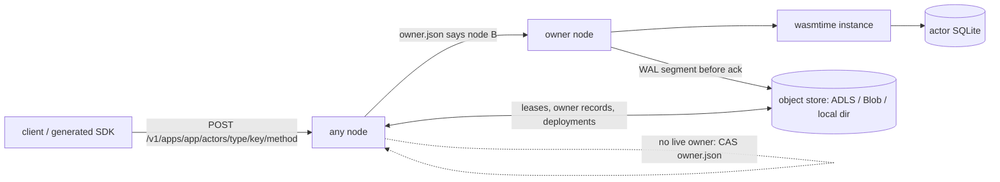
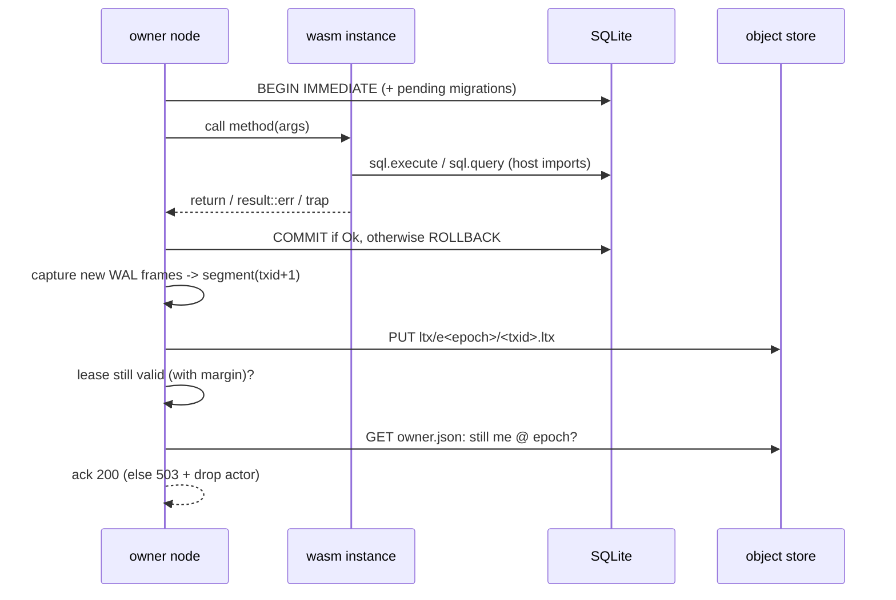

# Architecture

A statex cluster is a set of identical, stateless-looking
nodes plus one object store bucket, which is the only shared dependency. There
is no consensus service, no gossip and no routing table to configure.



## Concepts

| Term | Meaning |
|---|---|
| app | One deployed WASM component plus its manifest (`statex.toml`, migrations) |
| actor type | One exported WIT interface of the component, such as `counter` |
| actor | `(app, type, key)`: one instance with its own SQLite database |
| method | One function in the interface. The JSON arguments map to WIT parameters |
| node lease | `nodes/<id>.json`, renewed with If-Match. It proves the node is alive |
| owner record | `actors/<app>/<type>/<key>/owner.json`, holding `{node, session, epoch, state}` |
| epoch | Increases by one on every activation of an actor, anywhere in the cluster |

## Object store layout

```
fleet/peer-auth.json                         shared HMAC key for node-to-node calls
nodes/<node-id>.json                         node lease {session, advertise, expires_at_ms}
deploy/<app>/current.json                    {id, sha256, version}; CAS on deploy
deploy/<app>/<id>/component.wasm
deploy/<app>/<id>/manifest.json              WIT-derived schema, migrations, limits, http policy
actors/<app>/<type>/<key>/owner.json          ownership record (never deleted, so epochs stay monotonic)
actors/<app>/<type>/<key>/ltx/e<epoch>/snapshot-<txid>.db
actors/<app>/<type>/<key>/ltx/e<epoch>/<txid>.ltx      WAL page segment of one transaction
fleet/waker.json                             lease of the node that wakes idle actors' alarms
wake/<minute>/<app>/<type>/<key>/<at_ms>-<epoch>-<seq>   alarm wake hint (empty object)
outbox/<app>/<type>/<key>/<task-id>           asynchronous call wake hint
```

App names are `app` or `team/app`, where each segment is `[a-z0-9-]` and
neither `actors` nor `schema`. In store paths `/` becomes `.`, so
`payments/shop` is stored under `deploy/payments.shop/` and
`actors/payments.shop/`. This mapping is injective because `.` cannot appear in
a segment.

The store only needs four operations: get (with ranges), put, `put_if_absent`
and `put_if_match(etag)`, plus listing and delete. `statex diagnose` runs
a conformance probe against a bucket. Azure Blob/ADLS Gen2 support these
natively with `If-None-Match: *` and `If-Match`.

## Routing

The API is derived from the WIT, so teams register no routes:

```
POST   /v1/apps/{app}/actors/{type}/{key}/{method}    body: {"by": 1} or [1] or empty
POST   /v1/apps/{app}/actors/{type}/{key}/_create     explicit create (409 if it exists)
DELETE /v1/apps/{app}/actors/{type}/{key}
GET    /v1/apps, /v1/apps/{app}/schema, /v1/apps/{app}/actors?type=&limit=
```

`{app}` may be `team/app`. Because no app segment can be `actors` or `schema`,
the first such segment ends the app name. Keys are a single percent-encoded
segment.

When a node receives a call:

1. It validates the app, type, method and key, and takes the actor's local slot lock so calls to one actor are serialized.
2. If the actor is resident locally, it executes the call.
3. Otherwise it reads `owner.json`.
   - The record is `owned` by a node whose lease is live (same session, not expired): forward the call to that node's `advertise` URL over `POST /internal/v1/invoke`, which is HMAC-signed. Forwarding is limited to 4 hops.
   - Otherwise the record is missing, unowned, deleted, or its owner's lease is dead: CAS the record to `{me, epoch+1}` and **activate** the actor here.
4. If two nodes race on the CAS, exactly one wins. The loser re-reads the record and forwards.

Placement is therefore "first touch wins". An actor stays on its
node until that node goes idle on it (`--idle-timeout`), shuts down
gracefully, or dies. Clients may talk to any node, for example through a plain
L4 load balancer.

## Activation

1. Clear the local directory for the actor.
2. Restore unless the actor is new or deleted. Find the newest epoch that has a snapshot, download that snapshot, then apply the contiguous `.ltx` segments that follow it.
3. Open SQLite with WAL mode, `wal_autocheckpoint=0` and `synchronous=FULL`.
4. Checkpoint, and upload `snapshot-<txid>.db` into the **new** epoch prefix before serving any call.

The new epoch is therefore self-contained, and a stale owner writing into an
old epoch prefix can never corrupt it.

## Request path (write)



Read-only calls produce no WAL frames and skip the upload. Every
`snapshot_every` transactions (64 by default) the node writes a new snapshot
and deletes superseded segments and snapshots in the background.

Snapshots are streamed between the database file and the object store
(`put_file` / `get_to_file`) and are never held in memory whole. On Azure,
uploads go in 8 MiB blocks committed with one block list, and downloads use
8 MiB ranged reads pinned to one version with `If-Match`. After a
`TRUNCATE` checkpoint the database file is a complete image. The actor's slot
lock is held until the upload finishes, so the file cannot change mid-upload.

## Deployments

`statex deploy` does the following:

1. Builds and verifies the component, which includes instantiating it against migrated databases.
2. Uploads the component and its manifest under a content id.
3. CASes `current.json`. Inside the CAS loop it refuses the deploy if the new manifest is incompatible with the deployed one (unless `--allow-breaking`). Migrations are compared against the deployed manifest, which is what actors have actually applied.

Nodes poll `current.json` every 2s. Resident actors pick up the new code on
their next call; pending migrations run inside that call's transaction.

## Alarms

The authoritative alarm is a row in the actor's own SQLite database
(`_statex_alarm`: `at_ms`, `retry`, `epoch`, `seq`), so it is replicated and
restored like any other state, and `alarms.set/clear` are transactional. The
object store only holds **wake hints**, keys under `wake/<minute>/...` whose
name encodes `at_ms`, the epoch and a sequence number. Ordering in the write
path:

1. After a transaction that changed the alarm, the node PUTs the new hint
   **before** uploading the segment, so every durable alarm has a hint.
2. After the ack it deletes the old hint (best effort; stale hints are harmless).

Two mechanisms fire alarms:

- **Timers.** Each node keeps an in-memory timer for its resident actors
  (loaded at activation, updated after each committed change, dropped at
  eviction or release) and invokes the internal `alarm` operation when due.
- **Waker.** One node in the fleet holds the `fleet/waker.json` lease (CAS,
  TTL = `--lease-ttl`). Every `wake_tick` it lists the current minute
  prefixes, and every `wake_full_scan` (or after gaining the lease) all of
  `wake/`. For each due hint it invokes the actor through the normal routing
  path, which forwards to the owner or activates the actor elsewhere.

Firing reads the row: if the alarm is not due (it was moved or cleared), nothing
happens. Otherwise one transaction clears the row and runs the handler; if that
fails, a second transaction re-arms it with backoff. The response reports the
current hint name, and the waker deletes a hint that no longer matches (or whose
actor was deleted). Because calls to an actor are serialized and the row
decides, duplicate firings from a timer and the waker are harmless.

## Actor-to-actor calls

A caller imports generated client interfaces (`team:app/type`), whose functions
take the actor key first and return `result<T, statex:host/actors.call-error>`.
At instantiation the runtime links every such import dynamically
(`calls::link`). When it is called, the runtime converts the arguments to JSON
using the import's WIT signature, then calls the node's `ActorCaller`
(`NodeCaller`). The node does the following:

1. Builds an `Invocation` whose `chain` is the caller's chain plus the caller itself.
2. Rejects the invocation with `508 cycle` if the target is already on the chain or the chain has 16 entries. Each actor on the chain holds its slot lock while waiting, so re-entering one would deadlock.
3. Runs it through the normal `invoke` path: the local slot if this node owns the actor, otherwise a forward to the owner over the internal invoke endpoint, carrying the chain.
4. Bounds the wait by the caller's remaining deadline. If it runs out, the caller gets `call-error::timeout`.

The reply is mapped back to the typed result: `ok`, the callee's `err(E)`
(HTTP 422) in the inner result, or one of the `call-error` cases. A mismatch
between the callee's JSON and the caller's expected types becomes
`incompatible`. The callee commits in its own transaction, independent of the
caller's.

Deploys check imports against callees in both directions (`call_mismatches`):
a caller against the deployed callees, and a callee against the deployed
callers listed in the manifest's `calls`.

## Runtime and sandbox

- A wasmtime component model instance is created per resident actor.
- Execution time is bounded using epoch interruption (`limits.timeout_ms`) and memory is capped (`limits.memory_mb`).
- Imports are allowlisted to `statex:host/*`, WASI p2 and client interfaces of other apps (routed as actor calls). Nothing is granted beyond that: no preopened directories, no environment and no sockets. Guest stdout and stderr go to the node log.
- Outbound HTTP goes through `statex:host/http-client` and is restricted to `[http] allow` hosts.
- The guest `sql` interface rejects transaction-control statements (`BEGIN`, `COMMIT`, `SAVEPOINT`, ...) as well as `ATTACH`, `VACUUM` and `PRAGMA`, because the host owns the transaction.

## Transactional spawn

`statex:host/spawn.send` records a target and JSON arguments in the sender's
`_statex_outbox` table inside its current transaction. It returns a task id, not
the callee's result. Only local exported methods and methods declared by client
imports can be targeted. A stateless actor cannot schedule a durable spawn,
because it has no durable transaction.

Each newly created task gets an `outbox/<app>/<type>/<key>/<task-id>` hint before
the sender's WAL segment is uploaded (each component is percent-encoded,
including `/` in app names). Task ids contain fresh nonces, so a stale
hint from an abandoned write cannot name a later task. The fleet waker scans
these hints every `wake_tick`, with up to 16 asynchronous deliveries in flight.
It routes an internal claim to the sender, committing a two-minute task lease
before dispatch. It then releases the sender's lock and calls the destination.
The destination can therefore call back to the sender without re-entering its
original invocation.

After success, a separate sender transaction removes the task. Failed or
unknown-outcome deliveries are retried indefinitely with exponential delay,
capped at 60 seconds; errors are logged and stored on the outbox row. A lost
dispatcher leaves its task eligible after the task lease expires. Attempts are
numbered, and a late attempt cannot settle a newer one. The hint is removed
only after the durable sender state proves the task absent. Deleted senders
discard their pending tasks.

A stateful destination records successful delivery ids and results in
`_statex_inbox` in the same transaction as its method. Re-delivery returns that
receipt instead of re-running the method, including after failover. Receipts
are retained without automatic expiry. Stateless destinations have no receipt
store: they can run repeatedly and must make side effects idempotent. A new
`spawn.send` is a new task, so application-level retries of the producer method
still need their own idempotency key.

The queue in `examples/queue` is application code, not a host queue service.
It uses its SQL database for messages and batch leases, alarms for delivery
times, and spawn to call a stateless consumer after the lease is durable.
Consumer settlement returns through an ordinary actor call.

## Stateless execution

An actor type configured with `[actors.<type>] stateless = true` runs in a fresh
component instance on the receiving node for each call. It does not acquire an
owner record or persist a database. SQL storage, alarm scheduling and durable
spawn are unavailable, but ordinary typed actor calls and allowed outbound
HTTP remain available. Stateless types cannot declare migrations, an alarm
handler or group commit.

Each node admits at most 64 simultaneous stateless calls by default
(`statex node --max-stateless-calls`, or `STATEX_MAX_STATELESS_CALLS`).
Excess calls return 503. The slot remains occupied until the blocking Wasm
execution ends, even if the requesting future is cancelled. Stateless calls
still obey memory, execution-time and actor call-chain limits.
