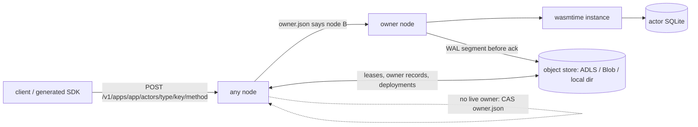
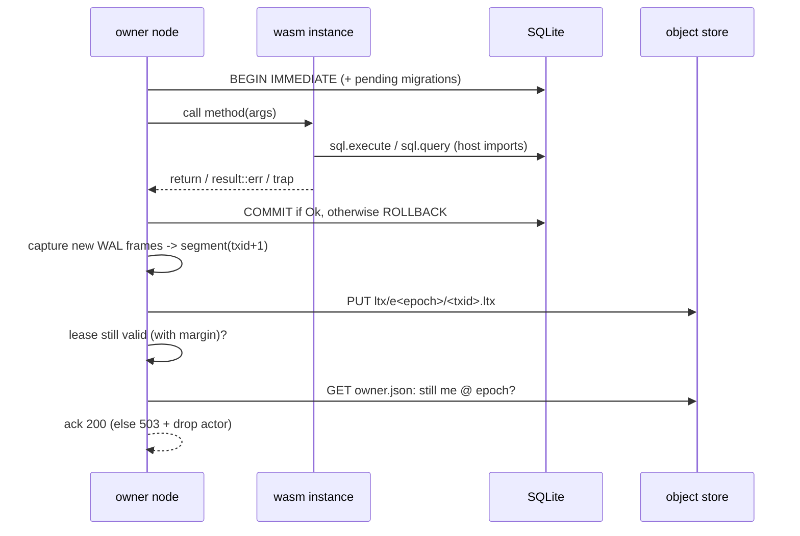

# Architecture

A statex cluster is a set of identical, stateless-looking
nodes plus one object store bucket, which is the only shared dependency. There
is no consensus service, no gossip and no routing table to configure.



## Concepts

| Term | Meaning |
|---|---|
| app | One deployed WASM component plus its manifest (`statex.toml`, migrations) |
| actor type | One exported WIT interface of the component, such as `counter` |
| actor | `(app, type, key)`: one instance with its own SQLite database |
| method | One function in the interface. The JSON arguments map to WIT parameters |
| node lease | `nodes/<id>.json`, renewed with If-Match. It proves the node is alive |
| owner record | `actors/<app>/<type>/<key>/owner.json`, holding `{node, session, epoch, state}` |
| epoch | Increases by one on every activation of an actor, anywhere in the cluster |

## Object store layout

```
fleet/peer-auth.json                         shared HMAC key for node-to-node calls
nodes/<node-id>.json                         node lease {session, advertise, expires_at_ms}
deploy/<app>/current.json                    {id, sha256, version, owner}; CAS on deploy
deploy/<app>/<id>/component.wasm
deploy/<app>/<id>/manifest.json              WIT-derived schema, migrations, limits, http policy
actors/<app>/<type>/<key>/owner.json          ownership record (never deleted, so epochs stay monotonic)
actors/<app>/<type>/<key>/ltx/e<epoch>/snapshot-<txid>.db
actors/<app>/<type>/<key>/ltx/e<epoch>/<txid>.ltx      WAL page segment of one transaction
```

App names are `app` or `team/app`, where each segment is `[a-z0-9-]` and
neither `actors` nor `schema`. In store paths `/` becomes `.`, so
`payments/shop` is stored under `deploy/payments.shop/` and
`actors/payments.shop/`. This mapping is injective because `.` cannot appear in
a segment.

The store only needs four operations: get (with ranges), put, `put_if_absent`
and `put_if_match(etag)`, plus listing and delete. `statex diagnose` runs
a conformance probe against a bucket. Azure Blob/ADLS Gen2 support these
natively with `If-None-Match: *` and `If-Match`.

## Routing

The API is derived from the WIT, so teams register no routes:

```
POST   /v1/apps/{app}/actors/{type}/{key}/{method}    body: {"by": 1} or [1] or empty
POST   /v1/apps/{app}/actors/{type}/{key}/_create     explicit create (409 if it exists)
DELETE /v1/apps/{app}/actors/{type}/{key}
GET    /v1/apps, /v1/apps/{app}/schema, /v1/apps/{app}/actors?type=&limit=
```

`{app}` may be `team/app`. Because no app segment can be `actors` or `schema`,
the first such segment ends the app name. Keys are a single percent-encoded
segment.

When a node receives a call:

1. It validates the app, type, method and key, and takes the actor's local slot lock so calls to one actor are serialized.
2. If the actor is resident locally, it executes the call.
3. Otherwise it reads `owner.json`.
   - The record is `owned` by a node whose lease is live (same session, not expired): forward the call to that node's `advertise` URL over `POST /internal/v1/invoke`, which is HMAC-signed. Forwarding is limited to 4 hops.
   - Otherwise the record is missing, unowned, deleted, or its owner's lease is dead: CAS the record to `{me, epoch+1}` and **activate** the actor here.
4. If two nodes race on the CAS, exactly one wins. The loser re-reads the record and forwards.

Placement is therefore "first touch wins". An actor stays on its
node until that node goes idle on it (`--idle-timeout`), shuts down
gracefully, or dies. Clients may talk to any node, for example through a plain
L4 load balancer.

## Activation

1. Clear the local directory for the actor.
2. Restore unless the actor is new or deleted. Find the newest epoch that has a snapshot, download that snapshot, then apply the contiguous `.ltx` segments that follow it.
3. Open SQLite with WAL mode, `wal_autocheckpoint=0` and `synchronous=FULL`.
4. Checkpoint, and upload `snapshot-<txid>.db` into the **new** epoch prefix before serving any call.

The new epoch is therefore self-contained, and a stale owner writing into an
old epoch prefix can never corrupt it.

## Request path (write)



Read-only calls produce no WAL frames and skip the upload. Every
`snapshot_every` transactions (64 by default) the node writes a new snapshot
and deletes superseded segments and snapshots in the background.

## Deployments

`statex deploy` does the following:

1. Builds and verifies the component, which includes instantiating it against migrated databases.
2. Uploads the component and its manifest under a content id.
3. CASes `current.json`. Inside the CAS loop it refuses the deploy if another owner holds the app (unless `--take-over`), or if the new manifest is incompatible with the deployed one (unless `--allow-breaking`). Migrations are compared against the deployed manifest, which is what actors have actually applied.

Nodes poll `current.json` every 2s. Resident actors pick up the new code on
their next call; pending migrations run inside that call's transaction.

## Runtime and sandbox

- A wasmtime component model instance is created per resident actor.
- Execution time is bounded using epoch interruption (`limits.timeout_ms`) and memory is capped (`limits.memory_mb`).
- Imports are allowlisted to `statex:host/*` and WASI p2. Nothing is granted beyond that: no preopened directories, no environment and no sockets. Guest stdout and stderr go to the node log.
- Outbound HTTP goes through `statex:host/http-client` and is restricted to `[http] allow` hosts.
- The guest `sql` interface rejects transaction-control statements (`BEGIN`, `COMMIT`, `SAVEPOINT`, ...) as well as `ATTACH`, `VACUUM` and `PRAGMA`, because the host owns the transaction.
